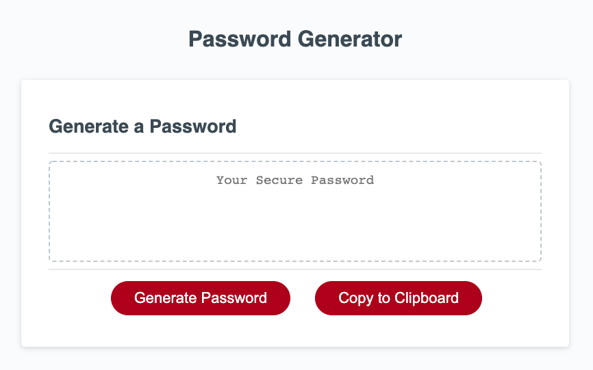
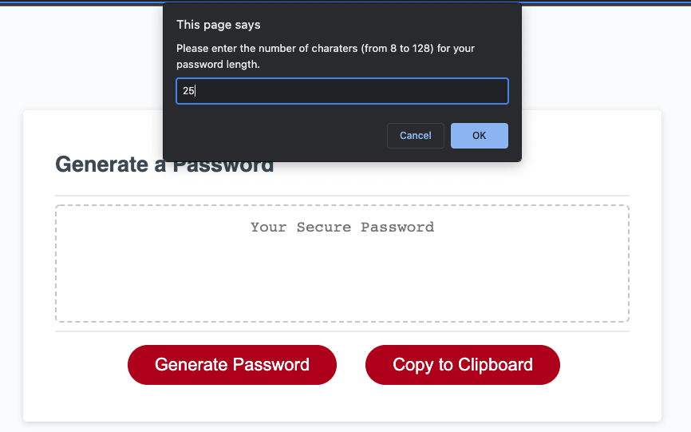
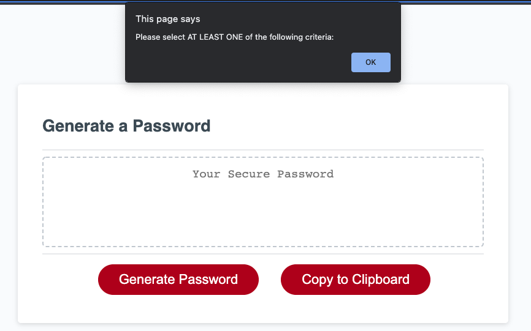
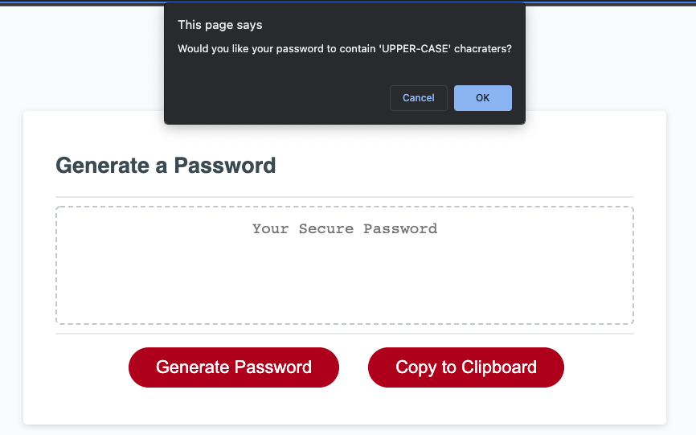
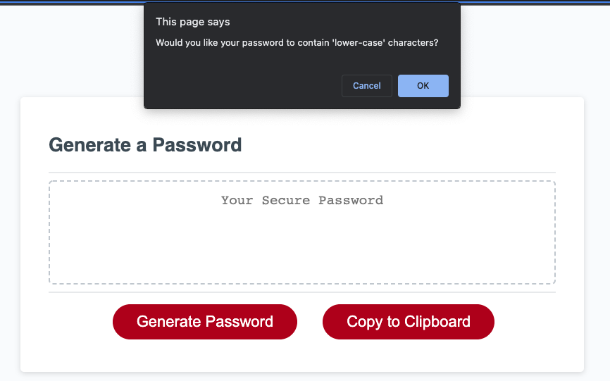
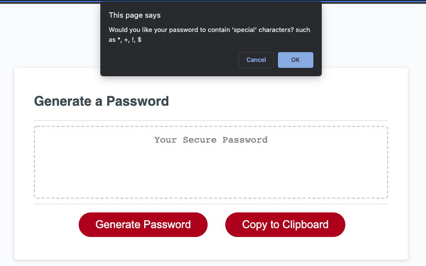
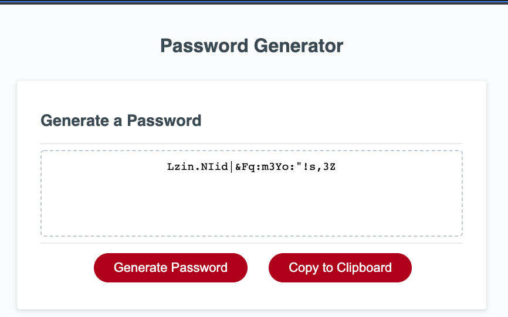

# Project Password Generator

## Purpose
A website that allows user to randomly generate secure passwords. The user can choose to have the following criteria for their passwords:
* Length of at least 8 characters and no more than 128 characters.
* Ability to choose to have at least one of the following chracter types:
** uppercase, 
** lower, 
** numeric, and/or 
** special characters.

## Built With
* HTML
* CSS
* Javascript

## Website
https://khanhlam90.github.io/password-generator/

## Contribution
Self-Built and online-research (such as https://stackoverflow.com/ and https://www.w3schools.com/)

## Screenshots demonstrates the web application's appearance and functionality:

### Notes
Sample screenshots demonstrate the selection of 25 character password length, and is selected to have all the character types.